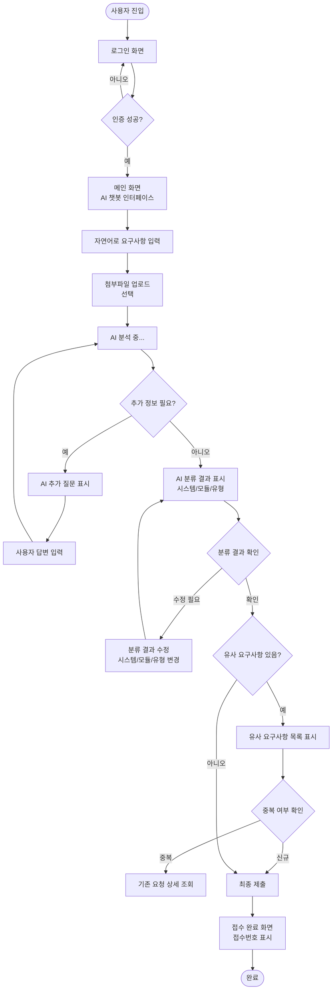
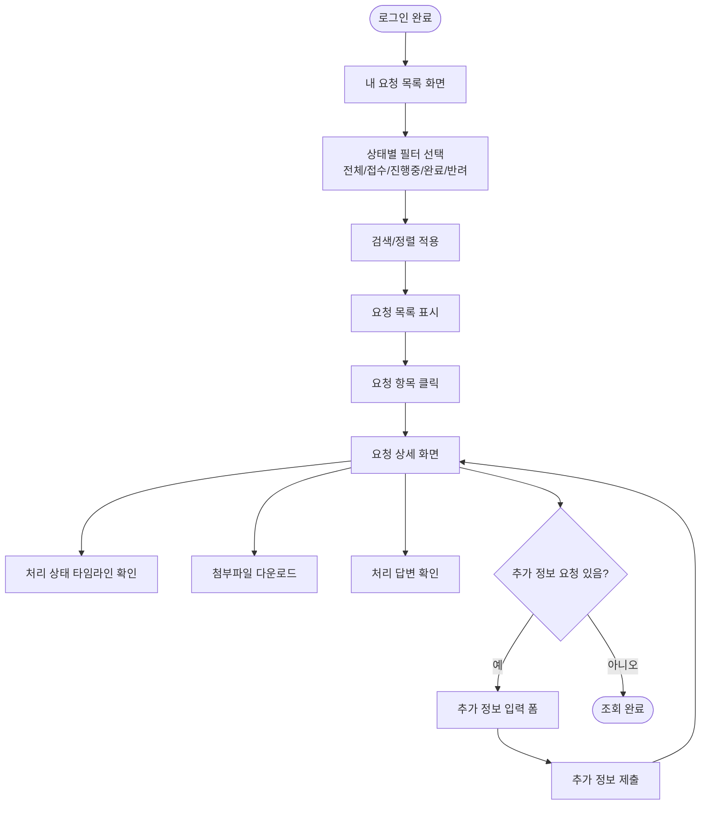
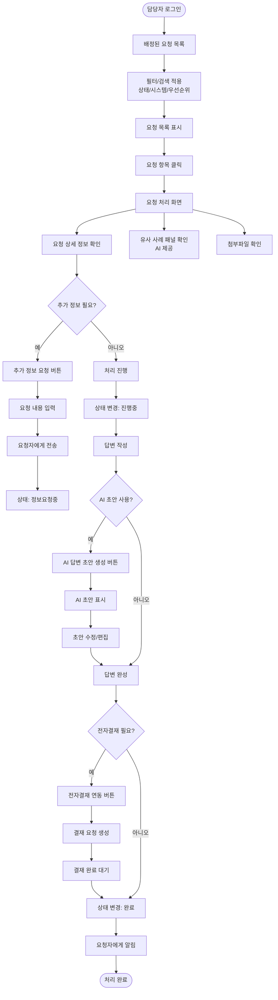
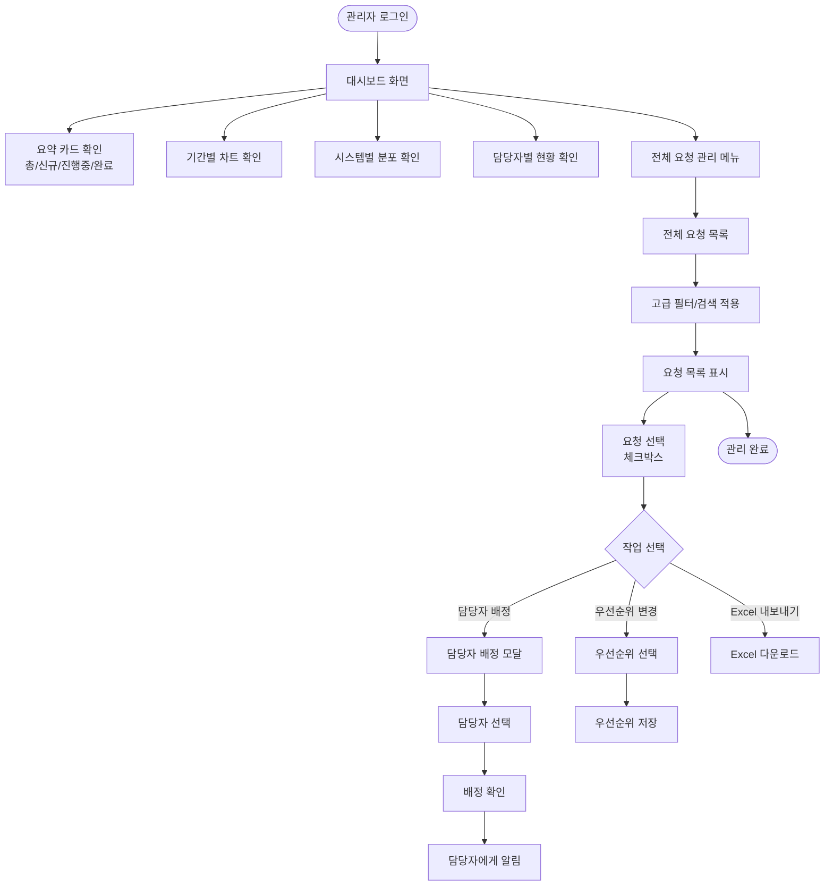
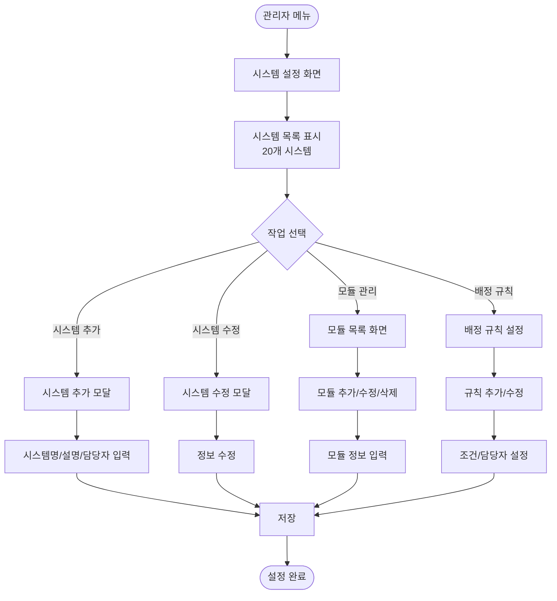
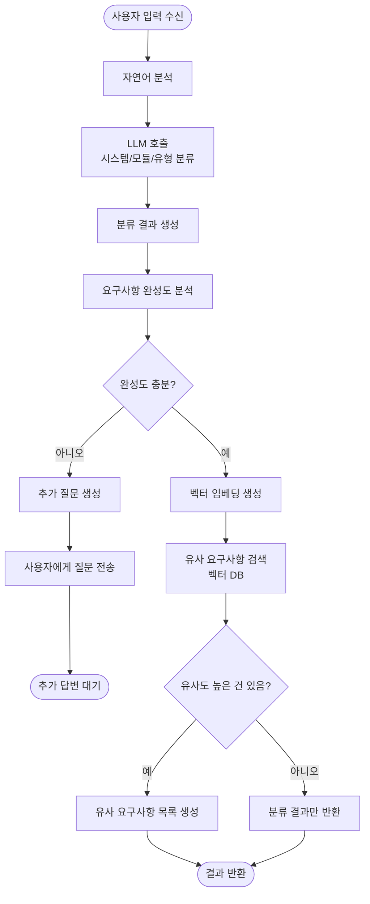
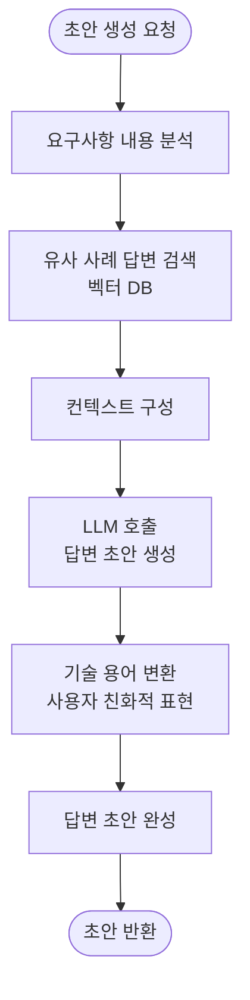
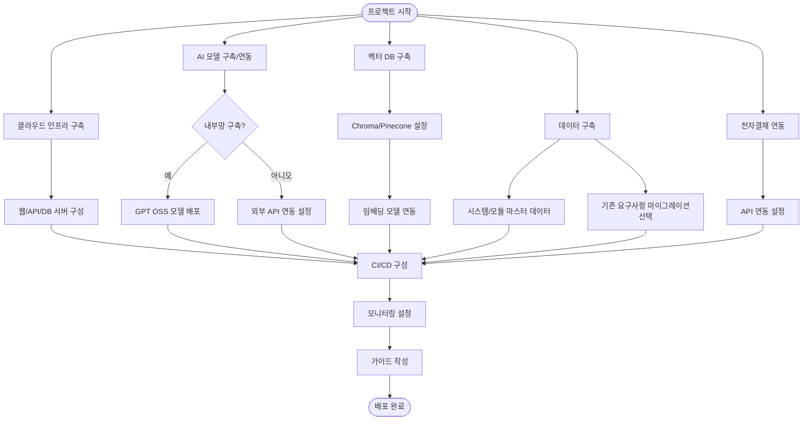

# POC4: AI 기반 IT 요구사항관리 시스템 - 유저 플로우

---

## 전체 시스템 구조

```mermaid
graph TD
    Start([시작])
    
    Start --> User[사용자 시스템<br/>요청자]
    Start --> Handler[처리담당자 시스템<br/>IT팀]
    Start --> Admin[관리자 시스템<br/>IT팀장]
    Start --> AI[AI 시스템]
    Start --> Data[데이터/인프라]
    
    User --> U1[로그인]
    User --> U2[AI 챗봇 요구사항 접수]
    User --> U3[내 요청 목록]
    User --> U4[요청 상세 조회]
    User --> U5[추가 정보 제공]
    
    Handler --> H1[담당자 로그인]
    Handler --> H2[배정된 요청 목록]
    Handler --> H3[요청 처리]
    Handler --> H4[추가 정보 요청]
    
    Admin --> A1[관리자 로그인]
    Admin --> A2[대시보드]
    Admin --> A3[전체 요청 관리]
    Admin --> A4[담당자 배정]
    Admin --> A5[시스템/모듈 설정]
    
    AI --> AI1[자연어 분석/분류]
    AI --> AI2[유사 요구사항 검색]
    AI --> AI3[답변 초안 생성]
    
    Data --> D1[시스템/모듈 데이터]
    Data --> D2[벡터 DB]
    Data --> D3[전자결재 연동]
    Data --> D4[인프라 구축]
```

---

## 사용자 시스템 (요청자) 상세 플로우

### 요구사항 접수 플로우 (메인)

### 내 요청 조회 플로우

---

## 처리담당자 시스템 상세 플로우

### 요청 처리 플로우

---

## 관리자 시스템 상세 플로우

### 대시보드 및 요청 관리 플로우

### 시스템/모듈 설정 플로우

---

## AI 시스템 상세 플로우

### AI 분류 및 검색 플로우

### AI 답변 초안 생성 플로우

---

## 데이터/인프라 플로우

### 시스템 구축 플로우

---

## 노드 요약

| 시스템 | 주요 화면/작업 | 노드 수 |
|--------|---------------|--------|
| 사용자 시스템 | 로그인, 챗봇 접수(입력/분류확인/제출), 요청목록, 요청상세, 추가정보제공 | 10 |
| AI 챗봇 시스템 | 자연어분석, 시스템분류, 추가질문, 분류결과표시, 분류수정 | 5 |
| 유사검색 시스템 | 임베딩생성, 유사검색, 중복탐지, 유사건표시 | 4 |
| 처리지원 AI | 답변초안생성, 용어변환, 유사사례추천 | 3 |
| 처리담당자 시스템 | 로그인, 요청목록, 요청처리, 상태변경, 답변작성, AI초안, 전자결재연동, 추가정보요청 | 10 |
| 관리자 시스템 | 로그인, 대시보드, 통계차트, 전체요청목록, 담당자배정, 우선순위조정, 시스템설정, 모듈관리, 배정규칙 | 10 |
| 데이터 연계 | 시스템/모듈데이터, 마이그레이션, 전자결재연동 | 3 |
| 인프라 | 클라우드구축, AI모델구축, 벡터DB구축, CI/CD, 모니터링, 가이드작성 | 6 |
| **합계** | | **51** |

