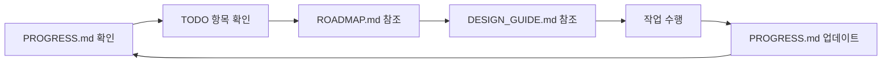

# Plan 폴더 가이드

> 이 폴더는 AI 기반 IT 요구사항관리 시스템의 개발 계획을 관리합니다.

---

## 폴더 구조

```
manager/plan/
├── README.md           ← 현재 파일 (폴더 사용 가이드)
├── ROADMAP.md          ← 전체 개발 방향 및 모듈별 로드맵
├── PROGRESS.md         ← 현재 진행 상황 추적 (★ 작업 지시용 메인 파일)
├── CLIENT_GUIDE.md     ← 클라이언트 요청 사항 가이드 (외부 연동용)
├── DESIGN_GUIDE.md     ← UI/UX 디자인 가이드 (KT 브랜드 컬러)
│
├── client/             ← 클라이언트 미팅 자료
│   └── 1211 미팅.txt
│
└── requirements/       ← 요구사항 문서
    ├── 01_요구사항정리.md
    ├── 02_주요개발범위.md
    ├── 03_기능상세화.md
    └── 04_유저플로우.md
```

---

## 파일별 역할

### ROADMAP.md
- **목적**: 전체 개발 방향과 단계별 흐름 설명
- **내용**: 기술 스택, Phase별 개발 계획, 모듈별 상세 스펙
- **규칙**: 상세 설명은 이 파일에만 작성. 다른 파일에서는 참조만.

### PROGRESS.md ⭐ (핵심)
- **목적**: 현재 작업 진행 상황 추적
- **내용**: 현재 상태, 마지막 완료 작업, 현재 TODO, 완료 이력
- **규칙**: **Cursor는 항상 이 파일을 기준으로 작업한다**

### CLIENT_GUIDE.md
- **목적**: 클라이언트에게 요청해야 할 외부 연동 사항 정리
- **내용**: 긴급/중간/후반 요청 항목별 체크리스트
- **규칙**: 우선순위가 높은 항목은 프로젝트 초반에 요청

### DESIGN_GUIDE.md 🎨 (디자인)
- **목적**: UI/UX 디자인 가이드라인 정의
- **내용**: KT 브랜드 컬러, 타이포그래피, 컴포넌트 스타일, CSS 변수
- **규칙**: 모든 UI 개발 시 이 가이드 참조

### requirements/
- **목적**: 요구사항 정의 및 분석 자료
- **내용**: 요구사항 정리, 개발 범위, 기능 상세화, 유저 플로우
- **규칙**: 참조용. ROADMAP에서 필요 시 링크

---

## Cursor 작업 규칙

### 기본 원칙

1. **PROGRESS.md가 유일한 작업 기준**
   - 작업 시작 전 항상 PROGRESS.md 확인
   - 작업 완료 후 반드시 PROGRESS.md 업데이트

2. **ROADMAP.md는 읽기 전용**
   - 직접 수정하지 않음
   - 변경이 필요하면 제안만 (사용자 승인 후 수정)

3. **DESIGN_GUIDE.md 준수**
   - UI 개발 시 KT 브랜드 컬러 사용
   - 컴포넌트 스타일 가이드 따르기

4. **4단계 작업 프로세스**
   ```
   1. 이전 작업 결과 확인 → "마지막 완료 작업" 섹션
   2. 이번 작업 범위 정의 → "현재 작업" 섹션의 TODO
   3. 작업 수행 → TODO 항목 순서대로 진행
   4. 상태 업데이트 → PROGRESS.md 업데이트
   ```

### 작업 흐름



---

## 기술 스택

| 영역 | 기술 |
|------|------|
| Frontend | Next.js 14+ (App Router) |
| Backend | Supabase (Auth, Database, Storage, Edge Functions) |
| Deployment | Vercel |
| UI | shadcn/ui + Tailwind CSS |
| AI | OpenAI API (또는 내부 LLM) |

---

## KT 브랜드 컬러 (요약)

| 컬러명 | HEX | 용도 |
|--------|-----|------|
| **KT Red** | `#E4002B` | 메인 브랜드, CTA 버튼 |
| **KT Black** | `#1A1A1A` | 다크 테마 배경 |
| **KT Gray** | `#666666` | 보조 텍스트 |

자세한 내용은 [DESIGN_GUIDE.md](./DESIGN_GUIDE.md) 참조

---

## 빠른 시작

1. **새 작업 시작**: `PROGRESS.md` 열기
2. **전체 방향 확인**: `ROADMAP.md` 참조
3. **디자인 확인**: `DESIGN_GUIDE.md` 참조
4. **상세 요구사항**: `requirements/` 폴더 참조
5. **외부 연동 확인**: `CLIENT_GUIDE.md` 참조
