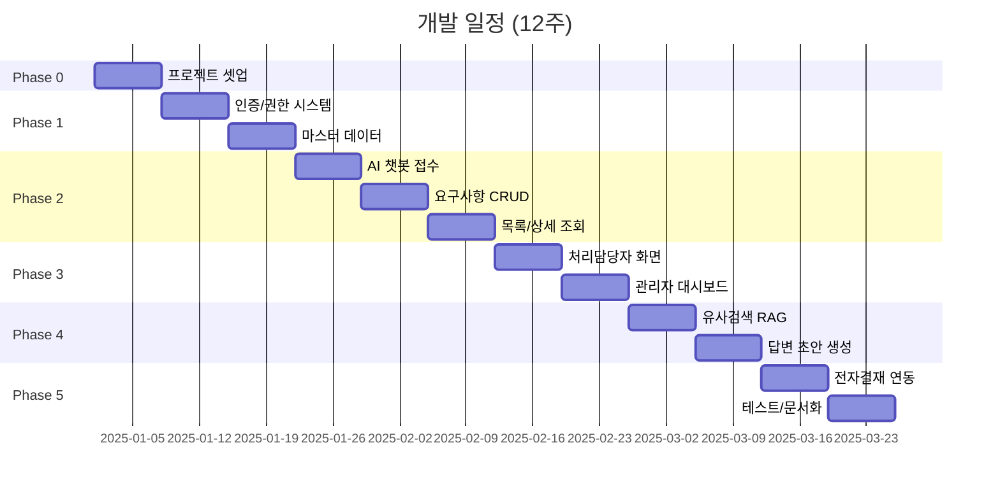
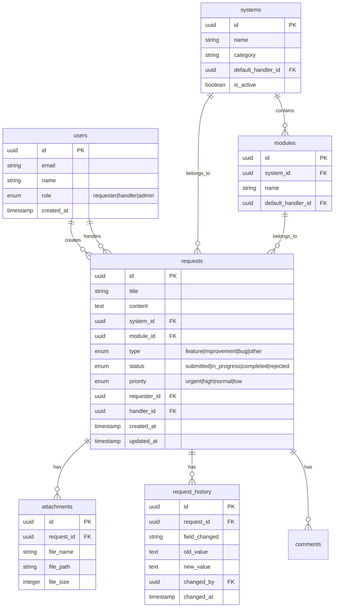

# ROADMAP: AI 기반 IT 요구사항관리 시스템

> 전체 개발 방향과 단계별 흐름을 정의합니다.
> 상세 요구사항은 [requirements/](./requirements/) 폴더를 참조하세요.

---

## 프로젝트 개요

| 항목 | 내용 |
|------|------|
| 프로젝트명 | AI 기반 IT 요구사항관리 시스템 POC |
| 목적 | IT 시스템 변경/개선 요청을 효율적으로 접수하고 관리, AI 활용 자동 분류 및 처리 지원 |
| 주요 사용자 | 요청자(전 임직원), 처리담당자(IT팀), 관리자(IT팀장) |
| 개발 기간 | 약 12주 (Phase 0~5) |

---

## 기술 스택

| 영역 | 기술 | 비고 |
|------|------|------|
| **Frontend** | Next.js 14+ (App Router) | React 기반, SSR/SSG 지원 |
| **Backend** | Supabase | Auth, Database (PostgreSQL), Storage, Edge Functions |
| **Deployment** | Vercel | CI/CD 자동화, Preview Deployments |
| **UI** | shadcn/ui + Tailwind CSS | 컴포넌트 기반, 테마 변경 용이 |
| **AI/LLM** | OpenAI API | GPT-4 또는 내부 LLM (결정 필요) |
| **Vector DB** | Supabase pgvector | RAG용 유사 검색 |

---

## 개발 단계 (Phase) 요약



---

## Phase 0: 프로젝트 셋업 (Week 1)

### 목표
개발 환경 구성 및 기본 인프라 셋업

### 모듈: M00 - 프로젝트 셋업

| 작업 | 설명 |
|------|------|
| 개발 환경 구성 | Node.js, pnpm, ESLint, Prettier 설정 |
| Next.js 프로젝트 초기화 | App Router, TypeScript 설정 |
| Supabase 연동 | 프로젝트 생성, 환경 변수 설정 |
| Vercel 연동 | Git 연결, 자동 배포 설정 |
| shadcn/ui 설정 | 기본 컴포넌트 설치, 테마 설정 |
| 기본 레이아웃 | 공통 레이아웃, 네비게이션 구조 |

### 산출물
- 동작하는 Next.js 앱 (Vercel 배포 완료)
- Supabase 연결 확인
- 기본 UI 컴포넌트 설정

---

## Phase 1: 기반 시스템 (Week 2-3)

### 목표
사용자 인증 및 마스터 데이터 관리

### 모듈: M01 - 인증/권한 시스템

| 작업 | 설명 |
|------|------|
| Supabase Auth 설정 | 이메일/비밀번호 인증 |
| 사용자 역할 관리 | 요청자/담당자/관리자 구분 |
| 보호된 라우트 | 인증 필요 페이지 가드 |
| 프로필 드롭다운 | 헤더 우측 사용자 메뉴 (프로필/알림설정/로그아웃) |
| 프로필 페이지 | 내 정보 조회/수정, 비밀번호 변경, 알림 설정 |

**참조**: 
- [requirements/01_요구사항정리.md](./requirements/01_요구사항정리.md) - 주요 사용자 섹션
- [requirements/03_기능상세화.md](./requirements/03_기능상세화.md) - 프로필/내 정보 섹션

### 모듈: M02 - 시스템/모듈 마스터 데이터

| 작업 | 설명 |
|------|------|
| DB 스키마 설계 | systems, modules, users 테이블 |
| 마스터 데이터 API | CRUD 엔드포인트 |
| 관리 화면 | 시스템/모듈 설정 UI |
| 초기 데이터 시딩 | 20개 시스템 데이터 입력 |

**참조**: [requirements/01_요구사항정리.md](./requirements/01_요구사항정리.md) - 20개 IT 시스템 목록

### 산출물
- 로그인/로그아웃 기능
- 역할 기반 접근 제어
- 시스템/모듈 마스터 관리

---

## Phase 2: 핵심 기능 (Week 4-6)

### 목표
AI 챗봇 기반 요구사항 접수 및 관리

### 모듈: M03 - AI 챗봇 요구사항 접수

| 작업 | 설명 |
|------|------|
| 챗봇 UI 구현 | 채팅 인터페이스, 메시지 컴포넌트 |
| LLM 연동 | OpenAI API 호출, 프롬프트 설계 |
| 자연어 분석 | 시스템/모듈/유형 자동 분류 |
| 분류 결과 확인 | 수정 가능한 폼 UI |
| 첨부파일 업로드 | Supabase Storage 연동 |

**참조**: 
- [requirements/03_기능상세화.md](./requirements/03_기능상세화.md) - AI 챗봇 시스템 상세
- [requirements/04_유저플로우.md](./requirements/04_유저플로우.md) - 요구사항 접수 플로우

### 모듈: M04 - 요구사항 CRUD

| 작업 | 설명 |
|------|------|
| DB 스키마 설계 | requests, attachments, history 테이블 |
| 요구사항 API | 생성/조회/수정/삭제 |
| 상태 관리 | 접수→진행중→완료/반려 워크플로우 |
| 이력 관리 | 상태 변경, 담당자 변경 이력 |

### 모듈: M05 - 요청 목록/상세 조회

| 작업 | 설명 |
|------|------|
| 요청 목록 화면 | 테이블, 필터, 검색, 정렬 |
| 요청 상세 화면 | 상세 정보, 첨부파일, 이력 |
| 내 요청 조회 | 요청자 본인 요청만 조회 |

**참조**: [requirements/04_유저플로우.md](./requirements/04_유저플로우.md) - 내 요청 조회 플로우

### 산출물
- AI 챗봇 요구사항 접수 기능
- 요구사항 목록/상세 조회
- 상태 관리 워크플로우

---

## Phase 3: 처리 시스템 (Week 7-8)

### 목표
처리담당자 및 관리자 기능 구현

### 모듈: M06 - 처리담당자 화면

| 작업 | 설명 |
|------|------|
| 배정된 요청 목록 | 담당자별 필터링 |
| 요청 처리 화면 | 상태 변경, 답변 작성 |
| 추가 정보 요청 | 요청자에게 추가 정보 요청 |

**참조**: [requirements/04_유저플로우.md](./requirements/04_유저플로우.md) - 요청 처리 플로우

### 모듈: M07 - 관리자 대시보드

| 작업 | 설명 |
|------|------|
| 대시보드 화면 | 요약 카드, 차트 (기간별/시스템별) |
| 전체 요청 관리 | 필터, 검색, 내보내기 |
| 담당자 배정 | 일괄 배정, 변경 |
| 우선순위 조정 | 긴급/높음/보통/낮음 |

**참조**: [requirements/04_유저플로우.md](./requirements/04_유저플로우.md) - 대시보드 및 요청 관리 플로우

### 산출물
- 처리담당자 전용 화면
- 관리자 대시보드
- 담당자 배정 기능

---

## Phase 4: AI 고도화 (Week 9-10)

### 목표
RAG 기반 유사 검색 및 AI 답변 생성

### 모듈: M08 - 유사 요구사항 검색 (RAG)

| 작업 | 설명 |
|------|------|
| pgvector 설정 | Supabase에 벡터 확장 활성화 |
| 임베딩 생성 | OpenAI Embeddings API 연동 |
| 유사 검색 구현 | 코사인 유사도 기반 검색 |
| 중복 탐지 | 유사도 임계값 기반 경고 |

**참조**: [requirements/03_기능상세화.md](./requirements/03_기능상세화.md) - 유사 요구사항 검색 시스템

### 모듈: M09 - 답변 초안 생성

| 작업 | 설명 |
|------|------|
| 답변 초안 API | LLM 기반 답변 생성 |
| 유사 사례 참조 | RAG 컨텍스트 활용 |
| 용어 변환 | 기술 용어 → 사용자 친화적 표현 |

**참조**: [requirements/03_기능상세화.md](./requirements/03_기능상세화.md) - 처리 지원 AI 시스템

### 산출물
- 유사 요구사항 자동 검색
- 중복 요청 탐지
- AI 답변 초안 생성

---

## Phase 5: 연동/마무리 (Week 11-12)

### 목표
외부 시스템 연동 및 마무리

### 모듈: M10 - 전자결재 연동 (선택)

| 작업 | 설명 |
|------|------|
| API 연동 | 전자결재 시스템 API 호출 |
| 결재 요청 생성 | 처리 완료 시 자동 생성 |
| 상태 동기화 | 결재 상태 조회 |

**참조**: [CLIENT_GUIDE.md](./CLIENT_GUIDE.md) - 전자결재 연동 섹션

### 마무리 작업

| 작업 | 설명 |
|------|------|
| 통합 테스트 | E2E 테스트, 성능 테스트 |
| 버그 수정 | QA 피드백 반영 |
| 문서화 | 사용자 가이드, API 문서 |
| 운영 준비 | 모니터링, 로깅 설정 |

### 산출물
- 전자결재 연동 (선택)
- 완성된 POC 시스템
- 문서화 완료

---

## DB 스키마 개요



---

## 화면 구조 (ChatGPT 스타일 UI)

### UI 컨셉
모든 주요 화면은 **좌측 목록 + 우측 AI 채팅** 레이아웃을 따릅니다.

```
┌─────────────────────────────────────────────────────────────┐
│ 헤더 (네비게이션, 사용자 정보)                                  │
├────────────────┬────────────────────────────────────────────┤
│                │                                            │
│   사이드바      │        메인 콘텐츠 영역                      │
│   (목록)       │        (AI 채팅 / 상세 정보)                 │
│                │                                            │
│  ┌──────────┐ │   ┌──────────────────────────────────┐    │
│  │ 새 대화   │ │   │  대화 히스토리                     │    │
│  ├──────────┤ │   │  (스크롤 가능)                    │    │
│  │ 대화 1   │ │   │                                  │    │
│  │ 대화 2   │ │   │  AI: 안녕하세요! 어떤 도움이...   │    │
│  │ 대화 3   │ │   │  사용자: 급여조회 개선 요청...    │    │
│  │ ...      │ │   │  AI: 분석 결과입니다...          │    │
│  └──────────┘ │   │  [요구사항 카드 미리보기]         │    │
│                │   └──────────────────────────────────┘    │
│                │   ┌──────────────────────────────────┐    │
│                │   │ 입력창...               [전송]    │    │
│                │   └──────────────────────────────────┘    │
├────────────────┴────────────────────────────────────────────┤
│ 액션바 (요구사항 확정, 상태 변경, 담당자 배정 등)                │
└─────────────────────────────────────────────────────────────┘
```

### 라우트 구조

```
/                           → 홈 (로그인 후 역할별 리다이렉트)
/login                      → 로그인
/register                   → 회원가입
/profile                    → 내 프로필 (정보 수정, 비밀번호 변경, 알림 설정)

/chat                       → AI 채팅 (요청자 메인) ★
  /chat/[conversationId]    → 특정 대화 (좌측 목록 + 우측 채팅)
  
/requests                   → 요구사항 현황 보드 (칸반 스타일)
  /requests/[id]            → 요구사항 상세 + AI 채팅

/workspace                  → 담당자/관리자 작업 공간 ★
  /workspace/[requestId]    → 요청 처리 (좌측 목록 + 우측 AI 협업)

/admin                      → 관리자 영역
  /admin/dashboard          → 통계 대시보드
  /admin/systems            → 시스템/모듈 관리
  /admin/users              → 사용자 관리
```

### 헤더 프로필 메뉴 구조

```
┌─────────────────────────────┐
│ 👤 홍길동                    │
│    hong@company.com         │
├─────────────────────────────┤
│ 📋 내 프로필     → /profile │
│ 🔔 알림 설정                 │
│ 🌙 다크모드                  │
├─────────────────────────────┤
│ 🚪 로그아웃                  │
└─────────────────────────────┘
```

### 역할별 화면 흐름

#### 요청자 (Requester)
1. `/chat` → AI와 대화하며 요구사항 작성
2. 대화 중 AI가 분석 → 요구사항 카드 미리보기
3. "요구사항 확정" → 카드가 `/requests` 보드로 이동
4. `/requests`에서 전체 현황 확인

#### 담당자 (Manager)
1. `/workspace` → 배정된 요청 목록 (좌측)
2. 요청 선택 → AI와 대화하며 처리 방안 논의 (우측)
3. AI가 답변 초안 생성, 유사 사례 제시
4. "처리 완료" → 요청자에게 알림

#### 관리자 (Admin)
1. `/admin/dashboard` → 통계 확인
2. `/workspace` → 전체 요청 확인 및 담당자 배정
3. `/admin/systems` → 시스템/모듈 관리

---

## 참조 문서

| 문서 | 설명 |
|------|------|
| [requirements/01_요구사항정리.md](./requirements/01_요구사항정리.md) | 전체 요구사항 정리 |
| [requirements/02_주요개발범위.md](./requirements/02_주요개발범위.md) | 주요 개발 범위 |
| [requirements/03_기능상세화.md](./requirements/03_기능상세화.md) | 기능 상세화 |
| [requirements/04_유저플로우.md](./requirements/04_유저플로우.md) | 유저 플로우 다이어그램 |
| [CLIENT_GUIDE.md](./CLIENT_GUIDE.md) | 클라이언트 요청 사항 |

