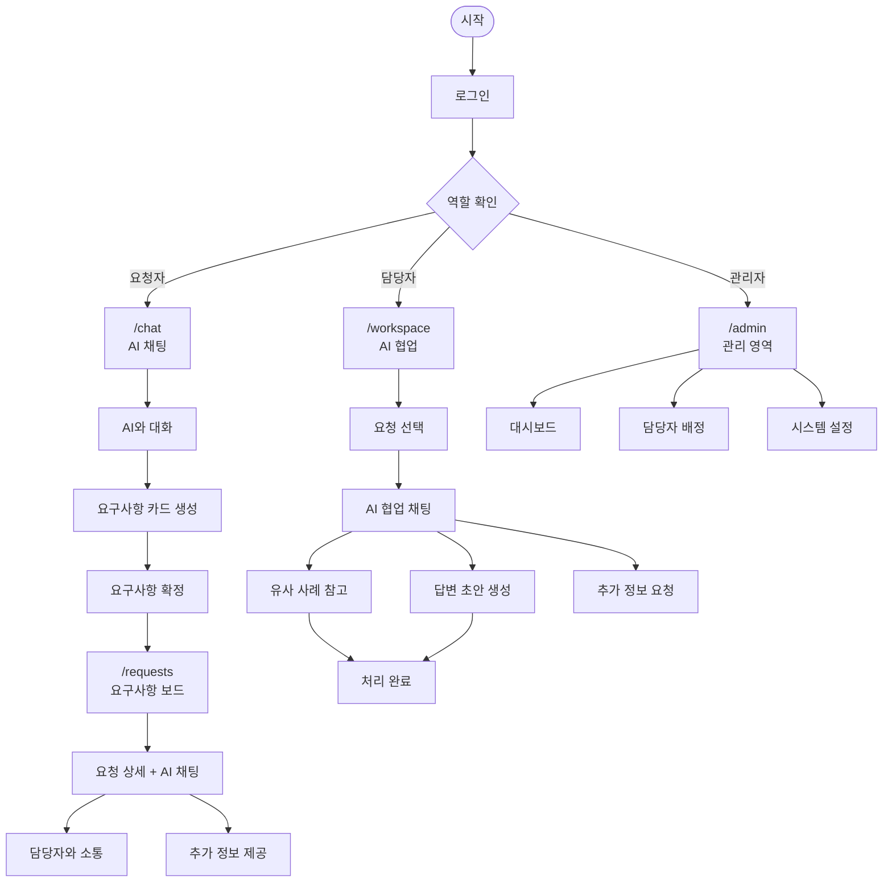
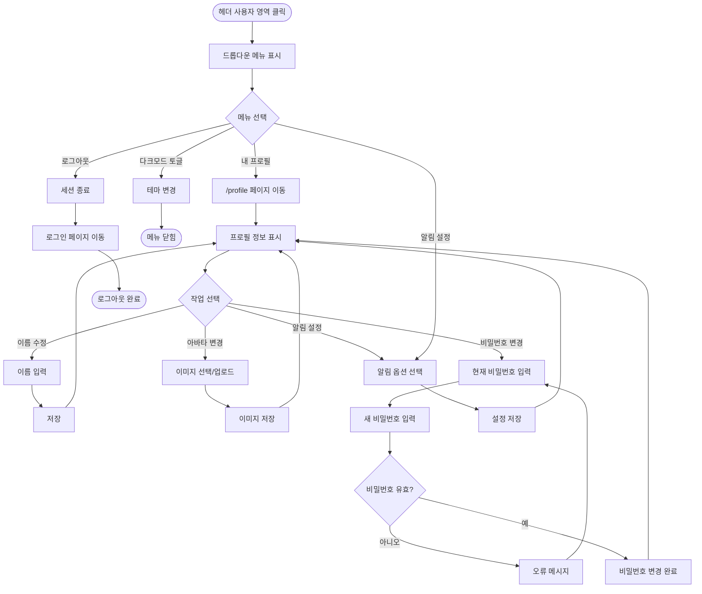
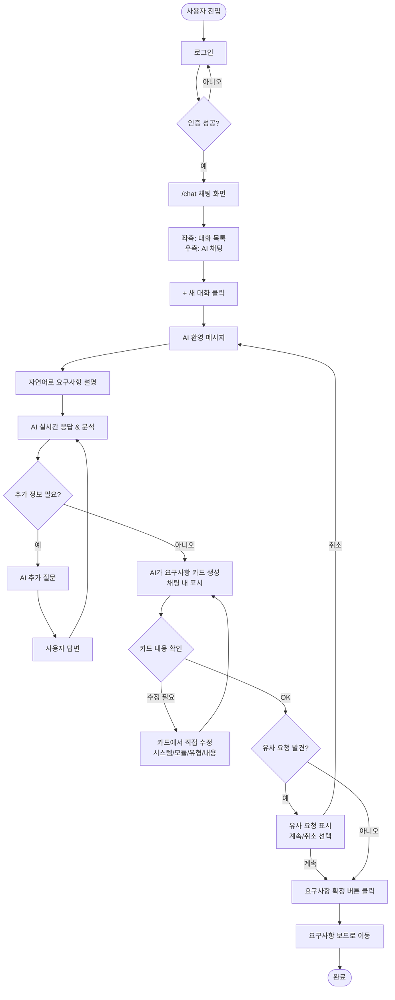
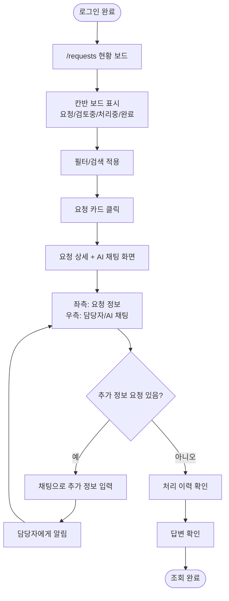
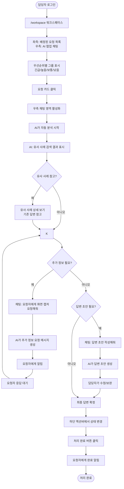
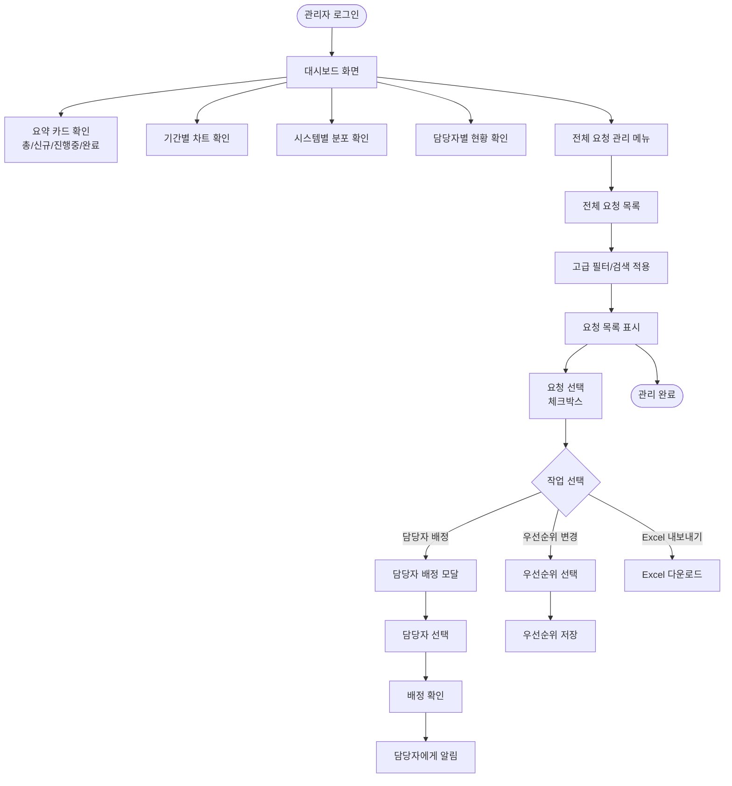
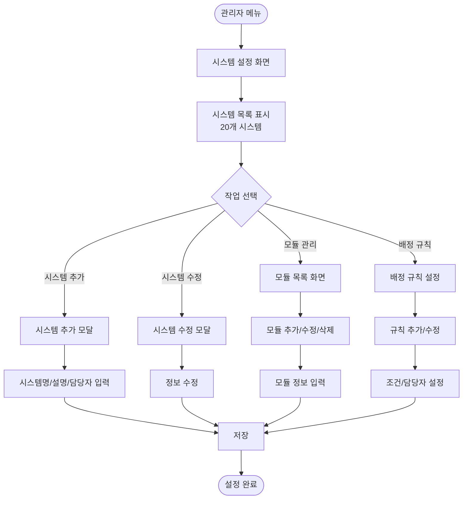
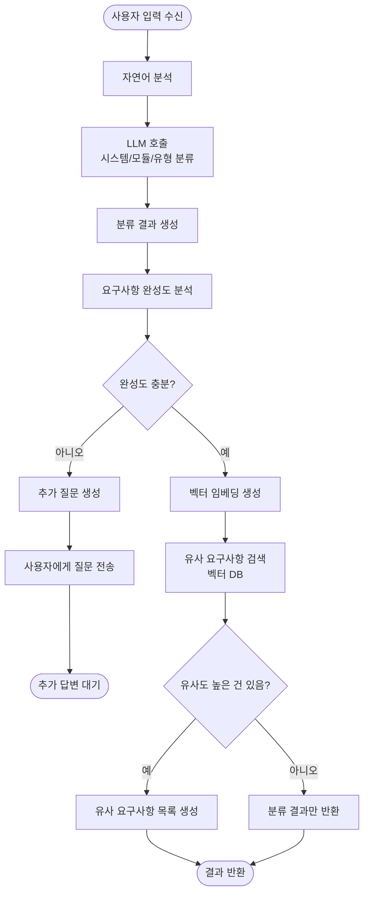
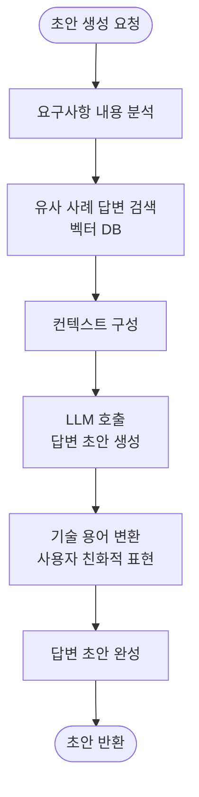
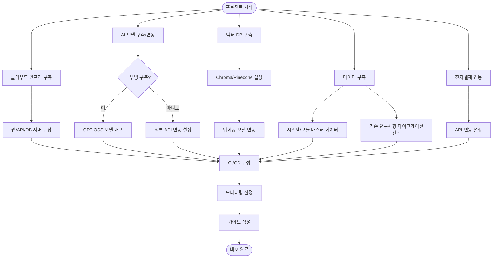

# POC4: AI 기반 IT 요구사항관리 시스템 - 유저 플로우

---

## 전체 시스템 구조 (ChatGPT 스타일)



---

## 핵심 화면 레이아웃

모든 주요 화면은 **좌측 목록 + 우측 AI 채팅** 레이아웃을 따릅니다.

```
┌─────────────────────────────────────────────────────────────┐
│ 헤더 (네비게이션, 알림, 사용자)                               │
├────────────────┬────────────────────────────────────────────┤
│                │                                            │
│  사이드바       │        메인 콘텐츠                          │
│  (목록)        │        (AI 채팅)                            │
│                │                                            │
│  ┌──────────┐ │   ┌──────────────────────────────────┐    │
│  │ + 새 대화 │ │   │                                  │    │
│  ├──────────┤ │   │  대화 히스토리                    │    │
│  │ 항목 1   │ │   │  (스크롤)                        │    │
│  │ 항목 2   │ │   │                                  │    │
│  │ ...      │ │   └──────────────────────────────────┘    │
│  └──────────┘ │   ┌──────────────────────────────────┐    │
│                │   │ 입력창                    [전송] │    │
│                │   └──────────────────────────────────┘    │
├────────────────┴────────────────────────────────────────────┤
│ 액션바 (컨텍스트에 따른 버튼들)                               │
└─────────────────────────────────────────────────────────────┘
```

---

## 사용자 시스템 (요청자) 상세 플로우

### 프로필/내 정보 플로우



---

### AI 채팅으로 요구사항 접수 플로우



### 요구사항 현황 확인 플로우



---

## 처리담당자 시스템 상세 플로우

### AI 협업 요청 처리 플로우



### AI 협업 예시 대화

```
┌─────────────────────────────────────────────────────────────┐
│ 요청: 급여명세서 조회 기간 확장                               │
│ ─────────────────────────────────────────────────────────── │
│                                                             │
│ 🤖 AI: 이 요청을 분석해볼게요.                               │
│        시스템: 인사/급여, 모듈: 급여명세서                    │
│        유형: 기능개선                                        │
│                                                             │
│        📚 유사 사례 3건을 찾았습니다.                        │
│        ┌───────────────────────────────────────────────┐   │
│        │ 1. 급여명세서 PDF 다운로드 (92% 유사) [보기]   │   │
│        │ 2. 급여조회 기간 필터 오류 (85% 유사) [보기]   │   │
│        └───────────────────────────────────────────────┘   │
│                                                             │
│ 👤 담당자: 1번 사례 답변 보여줘                              │
│                                                             │
│ 🤖 AI: 1번 사례의 답변입니다:                                │
│        "급여명세서 PDF 다운로드 기능이 추가되었습니다..."    │
│        [답변 복사하기]                                       │
│                                                             │
│ 👤 담당자: 이 요청에 대한 답변 초안 작성해줘                 │
│                                                             │
│ 🤖 AI: 답변 초안입니다:                                      │
│        ┌───────────────────────────────────────────────┐   │
│        │ 안녕하세요, 요청하신 급여명세서 조회 기간 확장 │   │
│        │ 건이 반영되었습니다.                           │   │
│        │                                               │   │
│        │ 변경 사항:                                     │   │
│        │ - 기존: 당해년도만 조회 가능                   │   │
│        │ - 변경: 전년도까지 조회 가능                   │   │
│        │                                               │   │
│        │ 적용 일자: 2025-01-02                         │   │
│        └───────────────────────────────────────────────┘   │
│        [수정하기] [이대로 전송]                              │
│                                                             │
└─────────────────────────────────────────────────────────────┘
```

---

## 관리자 시스템 상세 플로우

### 대시보드 및 요청 관리 플로우



### 시스템/모듈 설정 플로우



---

## AI 시스템 상세 플로우

### AI 분류 및 검색 플로우



### AI 답변 초안 생성 플로우



---

## 데이터/인프라 플로우

### 시스템 구축 플로우



---

## 노드 요약

| 시스템 | 주요 화면/작업 | 노드 수 |
|--------|---------------|--------|
| 사용자 시스템 | 로그인, 챗봇 접수(입력/분류확인/제출), 요청목록, 요청상세, 추가정보제공 | 10 |
| AI 챗봇 시스템 | 자연어분석, 시스템분류, 추가질문, 분류결과표시, 분류수정 | 5 |
| 유사검색 시스템 | 임베딩생성, 유사검색, 중복탐지, 유사건표시 | 4 |
| 처리지원 AI | 답변초안생성, 용어변환, 유사사례추천 | 3 |
| 처리담당자 시스템 | 로그인, 요청목록, 요청처리, 상태변경, 답변작성, AI초안, 전자결재연동, 추가정보요청 | 10 |
| 관리자 시스템 | 로그인, 대시보드, 통계차트, 전체요청목록, 담당자배정, 우선순위조정, 시스템설정, 모듈관리, 배정규칙 | 10 |
| 데이터 연계 | 시스템/모듈데이터, 마이그레이션, 전자결재연동 | 3 |
| 인프라 | 클라우드구축, AI모델구축, 벡터DB구축, CI/CD, 모니터링, 가이드작성 | 6 |
| **합계** | | **51** |

